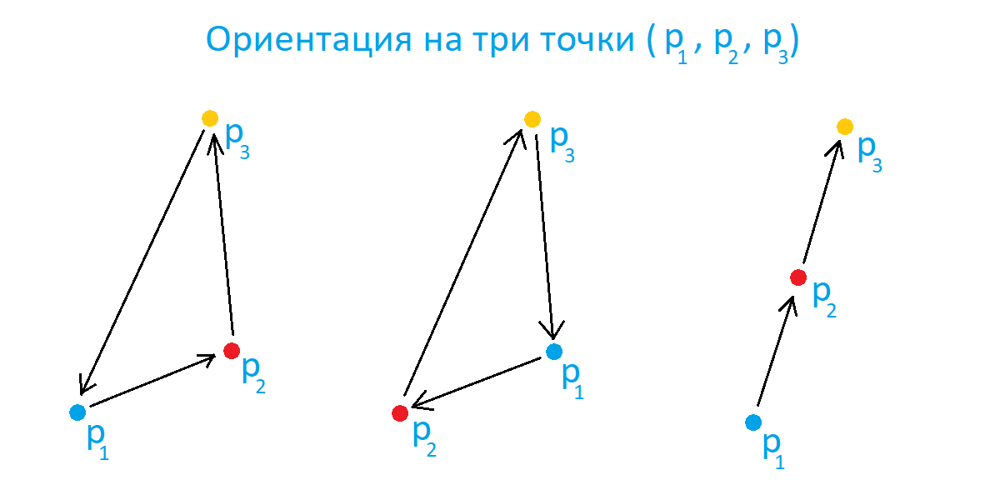

# **Пресичащи се отсечки**

Нека се намираме в равнината и всяка точка да записваме с наредената двойка координати . Тогава всяка линия ще е съвкупност от наредената двойка точки , където . Целта на вашата програма е да въвеждате линии в **свързан списък** и от него да намерите всички двойки линии, които се пресичат. За целта използвайте следните алгоритми:

## *Ориентация на три наредени точки*

Наредена тройка от точки  в равнината може да има една от трите **ориентации**: *по часовниковата стрелка, обратно на нея или да са колинеарни*.

Ще определим тяхната посока с помощта на следната формула:

където:

* d = 0 - колинеарни
* d > 0 - обратно на часовниковата стрелка
* d < 0 - по часовниковата стрелка

Повече как се достига до този резултат може да видите тук : https://math.stackexchange.com/questions/2941053/orientation-of-three-points-in-a-plane

*Горното условие беше поправено, защото съм преписал грешно обяснение на получения резултат, поради грешен източник, за което се извинявам.*

##  *Разположение на две отсечки*

Две отсечки може да се пресичат или да не се пресичат. Също така могат да са колинеарни или да не са. Две отсечки се определят дали се пресичат по следните начини: 

 1. Ако  и  са две неколинеарни отсечки с техните точки то те се пресичат тогава и само тогава когато:
    *  и имат различни посоки и също така
    *  и  имат различни посоки

 2. Ако двете отсечки са колинеарни т.е. , ,  и  са колинеарни, то те се пресичат когато:
    * проекциите на двете отсечки по ордината се пресичат и
    * проекциите на двете отсечки по абсцисата се пресичат

## Задача

**1.** Създайте подходящи структури (***struct***) **Point** и **Line**, за да съхранявате данните за точките и линиите в по-удобен формат

**2.** Създайте функция, която да проверява по три точки тяхната ориентация

**3.** Създайте функция, която по две прави определя дали се пресичат и ако се дали са колинеарни

**4.** Създайте функция, която по подаден списък от тип Line да връща опашка от всички двойки линии, които се пресичат както и дали са колинеарни или не

**5.** Създайте функция, която по подадена опашка от двойки линии да изписва на екрана форматирано даннните за двете линии и тяхното разположение

**6.** Реализирайте изпълнението на програмата в главната функция

