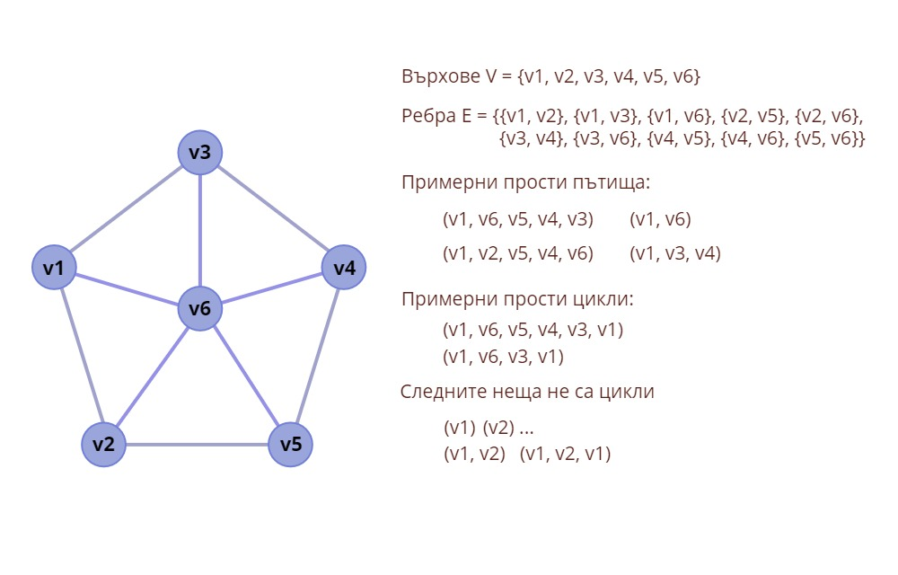
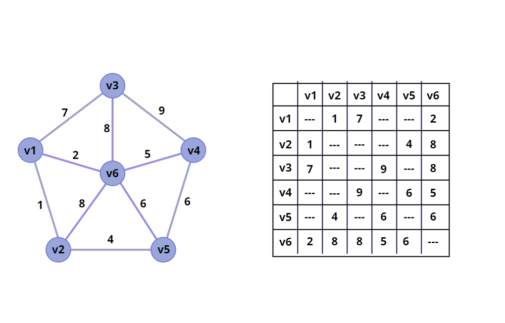
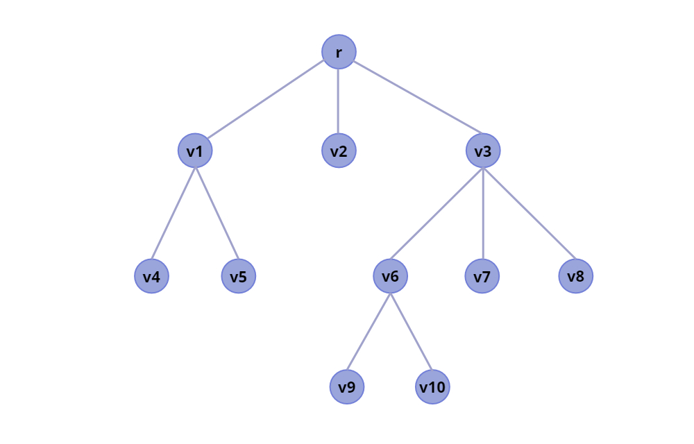
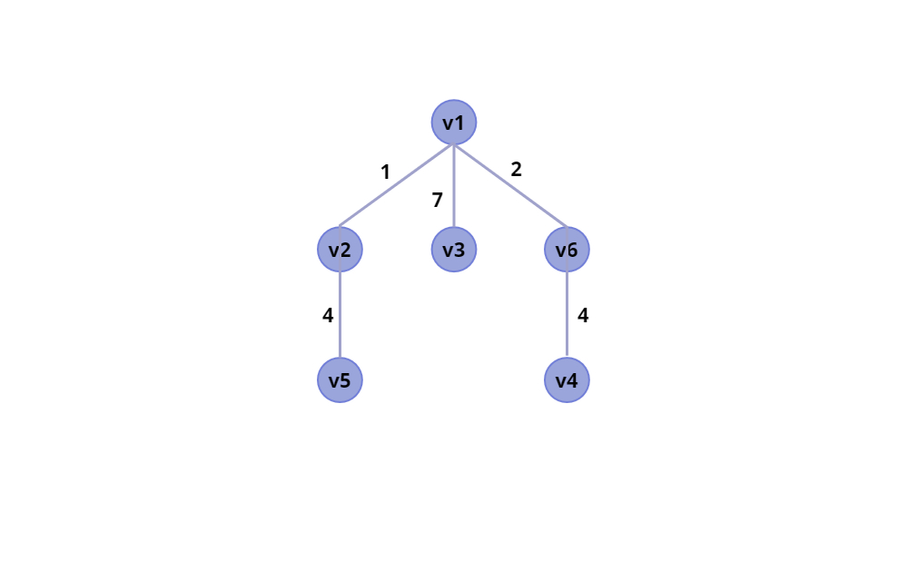

# **Алгоритъм на Дейкстра // Dijkstra’s Algorithm**

**Алгоритъма на Дейкстра** се занимава с това да намери **най-евтините пътища** от един възел до всички останали в един граф. За това нека първо разгледаме как се реализират неориентирани графи, и дървета в компютрите.

Неориентиран граф представлява едно множество **V** (*vertecies*) от върхове/възли и множество **Е** (*edges*) от двуелементни множества с елементи от върхове наречени ребра/дъги. **Път** от един възел до друг в графа ще дефинираме сравнително интуитивно: това е наредена редицата от възли и ребра през които трябва да преминем от началния  възел, за да стигме до другия. Тъй като ще работим само с неориентиран граф то пътя можен просто да го запишем като наредена редица от възли и да пропуснем имената на ребрата. **Цикъл** също е интуитивно за дефиниция: това е път, в който началния и крайния възел си съвападат и за всеки 3 поредни възела от пътя  (Важно: това е вярно само за неориентиран граф, защото ако  ребрата   и , са еквивалентни. Отколкото за ориентираните графове ребрата ). Един път наричаме прост ако той не съдържа цикли в себе си. За нас графовете ще свързани, т.е. съществува поне един прост път за всеки два възела на графа. На следната картинка е даден пример за неориентиран граф, неговите върхове, ребра, пътища и цикли:

Как се представя един граф в компютъра. Има няколко варианта, но вие ще представите графа като квадратна матрица (т.н. матрица на съседство), където двойките индекси съответсващи на клеткта от матрицата ще съответсват на елемент от множеството на ребрата. Нека ако в клетката има число <= 0 то да считаме, че няма ребро между двата възела. А ако има стойност > 0 то това ще е стойността на възела, за което ще трябва да преминем от единия възел към другия (т.н. тегло на реброто). Така матрицата на съседство за примерния граф ще има следния вид (ако добавим съответните стойности на ребрата разбира се):

Дърво представлява ацикличен граф. т.е за всеки два елемента от от множеството на възлите съществува само един единствен прост път от единия до другия възел. Вие ще използвате ориентирани коренни дървета, където има някои други термини за имената на възлите. Един възел ще е баща за друг ако има съответно връзка от бащата към другия възел. Корен на дървото се нарича възела, от който започва дървото, и който няма баща. Листо на едно коренно дърво наричаме възел, който не е баща за друг възел. Пример за дърво:

Вашата задача е да реализирате следния алгоритъм на Дейкста (който ще изучавате втори курс по Дискретна математика), и да създадете от даден граф и начален възел кореново дърво, което описва пътя до всеки връх и минималната цена до него.

Решението на примерния граф от връх v1 е следното:

Като разтоянието от v1 до даден връх е просто сумата на ребрата по пътя.

Информация за алгоритъма на Дейкстра може да разгледате на следните места:

* От лекциите на ФМИ - http://fmi.wikidot.com/tg2
* Видео, в което е илюстриран алгоритъма - https://www.youtube.com/watch?v=pVfj6mxhdMw
* Няма как да пропуснем Wikipedia - https://en.wikipedia.org/wiki/Dijkstra%27s_algorithm